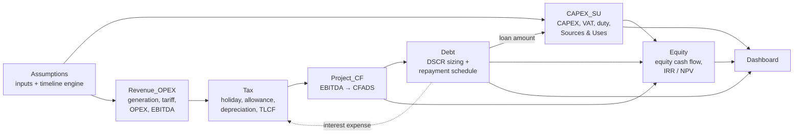

# Geothermal Power Project Finance Model

An Excel-based project finance model for a 55 MW geothermal power plant. It takes technical, cost, tariff, tax and financing assumptions and produces a full construction-and-operations cash flow, a **DSCR-sculpted debt sizing**, and **Project / Equity IRR and NPV**.

> **Units:** US$ million unless stated. Tariff in US$/kWh, OPEX in US$/MWh.
> **Model horizon:** 40 annual columns (`D:AQ`), starting from the construction start date (base case 2027–2066).

---

## Table of contents

1. [Quick start](#quick-start)
2. [Base-case results](#base-case-results)
3. [How the model flows](#how-the-model-flows)
4. [Sheet-by-sheet guide](#sheet-by-sheet-guide)
5. [The circular reference (read this)](#the-circular-reference-read-this)
6. [Modelling notes & known limitations](#modelling-notes--known-limitations)
7. [Repository structure](#repository-structure)
8. [License](#license)

---

## Quick start

1. Open `Geothermal_Power_Project_Finance_Model.xlsx` in **Microsoft Excel**.
2. Enable iterative calculation: **File → Options → Formulas → Enable iterative calculation** (see [why](#the-circular-reference-read-this)).
3. Change any **blue** cell on the `Assumptions` sheet. Everything else recalculates.
4. Read results on the `Dashboard` sheet.

**Colour convention:** blue = hard-coded input · black = formula · green = link from another sheet.

---

## Base-case results

| Metric | Value |
|---|---|
| Installed capacity / capacity factor | 55 MW / 90 % → 433.6 GWh p.a. |
| Total CAPEX | US$247.5 m (US$4.5 m/MW) |
| Total project cost (incl. VAT, duty, development, fee) | US$293.2 m |
| Maximum debt capacity (sculpted @ 1.30x DSCR, 6.5 %, 15 yrs) | US$151.7 m (51.7 % of funding) |
| Equity requirement | US$141.5 m (48.3 %) |
| Year-1 revenue / EBITDA | US$26.0 m / US$19.0 m |
| **Equity IRR** | **5.70 %** (cost of equity 14 % → Equity NPV −US$87.8 m) |
| **Project IRR** | **5.48 %** (WACC 10 % → Project NPV −US$105.9 m) |
| Min / average DSCR | 1.30x / 1.30x |

At the default tariff of US$0.06/kWh the project does **not** clear its cost of equity. The base case is a worked example, not an investment case: change the tariff, CAPEX or financing inputs on the `Assumptions` sheet to test what makes the project bankable.

---

## How the model flows



In words: **Assumptions → Revenue/OPEX → EBITDA → Tax → CFADS → Debt sizing → Debt schedule → Equity cash flow → IRR.** The dotted feedback loop (interest → tax → CFADS → debt size → interest) is the model's one intentional circularity.

---

## Sheet-by-sheet guide

All time-series sheets share the same layout: **column A** = row labels, **column C** = scalars / totals, **columns D:AQ** = one column per model year. Rows 4–7 repeat the calendar year, period type and year counters (linked from `Assumptions`).

### 1. `Assumptions` — inputs and timeline engine

The only sheet you should edit. Nine input blocks:

| # | Block | Key inputs (base case) |
|---|---|---|
| 1 | Dates & timeline | Construction start 1 Jan 2027, 3-yr construction, COD = start + construction (`EDATE`), 30-yr operating life, 30-yr PPA |
| 2 | Project / technical | 55 MW, 90 % capacity factor → **Annual generation (GWh) = MW × CF × 8760 / 1000** |
| 3 | CAPEX | US$4.5 m/MW → Total CAPEX = MW × CAPEX/MW; development cost US$8 m; financing fee 1.5 % of debt; **CAPEX phasing** 30 / 45 / 25 / 0 / 0 % by construction year (with a must-equal-100 % check) |
| 4 | VAT & import duty | VAT 11 %, import duty 5 % applied to 60 % of CAPEX |
| 5 | Corporate tax | 22 % CIT; 5-yr tax holiday; 30 % tax allowance over 6 yrs; tax depreciation 20 yrs SL; accounting depreciation 30 yrs SL; **incentive scenario switch** (drop-down: `None` / `Tax Holiday Only` / `Tax Allowance Only` / `Holiday + Allowance`) |
| 6 | Tariff & revenue | US$0.06/kWh, 2 % p.a. escalation, structure drop-down (`Flat` / `Escalated`), escalation start year |
| 7 | Operating costs | US$15/MWh, 70 % of OPEX bears VAT, 2 % p.a. OPEX escalation, maintenance CAPEX 1.5 % of revenue |
| 8 | Financing | Required DSCR 1.30x, interest 6.5 %, tenor 15 yrs, cost of equity 14 %, WACC 10 %. **Loan amount is not an input** – it is an output of the `Debt` sheet |
| 9 | **Timeline engine** (rows 65–73) | Model year #, calendar year, period type (Construction / Operation), construction year #, operating year #, debt year #, and 1/0 flags for *within PPA*, *within tax-holiday window*, *within tax-allowance window* |

The timeline engine drives every other sheet. To change the project length, edit the *Construction Period* and *Operating Life* inputs, never the engine itself.

### 2. `CAPEX_SU` — CAPEX and Sources & Uses

**Uses of funds** (per construction year):

| Row | Formula logic |
|---|---|
| CAPEX phasing % | Looks up the construction year in `Assumptions!B23:B27` |
| CAPEX | Total CAPEX × phasing % |
| Import duty | CAPEX × % subject to duty × duty rate |
| VAT | (CAPEX + duty) × VAT rate – treated as a real, non-recoverable cash cost |
| Development costs | Charged entirely in construction year 1 |
| Financing fee | Fee % × loan amount, charged in the final construction year |
| **Total uses** | Sum of the five lines |

**Sources of funds:** debt drawdown = total uses × debt % of funding (applied pro-rata to every construction year); equity contribution = uses − debt. A check row confirms Sources − Uses = 0.

**Summary block** (column C): totals of every cost line, *Maximum Debt Capacity* (linked from `Debt!C19`), *Debt %* = loan ÷ total project cost, and *Equity requirement* = total cost − loan.

### 3. `Revenue_OPEX` — generation, tariff, revenue, OPEX, EBITDA

| Line | Logic |
|---|---|
| Generation (GWh) | Constant annual generation in every operating year, 0 otherwise |
| PPA flag | 1 while operating year ≤ PPA tenor |
| Tariff (US$/kWh) | If `Escalated`: initial tariff × (1 + esc)^max(op. year − escalation start year, 0); if `Flat`: initial tariff |
| **Revenue** | Generation (GWh) × tariff (US$/kWh) × PPA flag. Units work out directly to US$ m (1 GWh × US$1/kWh = US$1 m) |
| OPEX – base | Generation × US$/MWh × (1 + OPEX esc)^(op. year − 1) ÷ 1000 |
| OPEX – VAT | Base OPEX × % subject to VAT × VAT rate (non-recoverable) |
| Total cash OPEX | Base + VAT |
| **EBITDA** | Revenue − total cash OPEX |

### 4. `Tax` — incentives, depreciation, loss carry-forward

**Flags and deductions**

- *Tax holiday active* and *Tax allowance active* – the raw windows from `Assumptions`, switched on/off by the scenario drop-down.
- *Tax allowance deduction* = Total CAPEX × allowance % ÷ allowance years (30 % × 247.5 ÷ 6 = US$12.375 m p.a. for 6 years).
- *Tax depreciation* = Total CAPEX ÷ 20 years (straight-line). *Accounting depreciation* = Total CAPEX ÷ 30 years (memo only, does not affect cash).

**Levered tax calculation** (drives CFADS and equity returns)

```
Taxable income (pre-TLCF) = EBITDA − tax depreciation − tax allowance − interest expense
Loss generated            = max(−taxable income, 0)
Loss utilised             = min(opening TLCF, max(taxable income, 0))
Closing TLCF              = opening + generated − utilised
Tax payable               = (max(taxable income, 0) − loss utilised) × CIT rate
Cash tax                  = 0 during tax holiday, otherwise tax payable
```

**Unlevered memo block** – the same calculation with zero interest. It feeds the *Project IRR*, which by definition ignores financing.

### 5. `Project_CF` — EBITDA → CFADS bridge

| Line | Logic |
|---|---|
| CAPEX outflow (construction) | CAPEX + duty + VAT + development costs (financing fee excluded) |
| Revenue, cash OPEX, **EBITDA** | Linked from `Revenue_OPEX` |
| Accounting depreciation, EBIT, interest, net operating cash flow | Memo lines |
| Maintenance CAPEX | Revenue × maintenance % |
| **CFADS** | **EBITDA − levered cash tax − maintenance CAPEX** |
| Unlevered net cash flow | EBITDA − unlevered cash tax − maintenance CAPEX |
| **Project pre-financing cash flow** | −construction outflow + unlevered net cash flow (used for Project IRR) |

### 6. `Debt` — DSCR sculpting and repayment schedule

**Sizing** (only within the debt tenor):

```
Max debt service_t   = CFADS_t ÷ Required DSCR
Discount factor_t    = 1 ÷ (1 + interest rate)^(debt year t)
Maximum loan amount  = Σ (Max debt service_t × Discount factor_t)     ← cell C19
```

The loan is the present value, at the interest rate, of the debt service that CFADS can support at the target DSCR.

**Schedule**

| Row | Logic |
|---|---|
| Opening balance | Loan amount in debt year 1, prior closing balance afterwards |
| Interest | Opening balance × rate |
| Principal | min(max(max debt service − interest, 0), opening balance) |
| Actual debt service | Interest + principal |
| Closing balance | Opening − principal |
| Actual DSCR | CFADS ÷ actual debt service |

**Checks (column C):** closing balance at the final debt year (should be ≈ 0), minimum DSCR and average DSCR (both 1.30x in the base case, confirming a fully sculpted profile).

### 7. `Equity` — equity cash flow and returns

| Line | Logic |
|---|---|
| Equity contribution | From `CAPEX_SU` (construction years) |
| CFADS, actual debt service | Memo links |
| Distribution to equity | CFADS − actual debt service (operating years) |
| **Equity cash flow** | −contribution + distribution |
| Cumulative equity cash flow | Running sum (payback view) |
| Project pre-financing cash flow | Memo, from `Project_CF` |

**Returns summary (column C):**

| Metric | Formula |
|---|---|
| Equity IRR | `IRR(equity cash flow, 0.12)` |
| Equity NPV | First cash flow + `NPV(cost of equity, remaining flows)` |
| Project IRR | `IRR(project pre-financing cash flow, 0.10)` |
| Project NPV | First cash flow + `NPV(WACC, remaining flows)` |

A financing summary (debt capacity, equity requirement, debt %, min/avg DSCR) is repeated below for reference.

### 8. `Dashboard` — one-page summary

Five headline tiles (Equity IRR, Project IRR, Max Debt Capacity, Equity Requirement, Debt % of Funding), then four read-only panels (Project, Commercial, CAPEX, Financing), a Returns panel (both IRRs and NPVs) and a short "how this model works" note. Every number is a link; nothing is typed in.

---

## The circular reference (read this)

The loop is:

```
interest expense → taxable income → cash tax → CFADS → max debt service → loan amount → interest expense
```

It is intentional and standard for DSCR-sculpted project finance: interest is tax-deductible, and tax reduces the CFADS that sizes the debt. In the base case cash tax is zero for the whole debt tenor (tax holiday, allowance and loss carry-forwards; the first cash tax appears in operating year 18), so the loop is dormant. It becomes active when a higher tariff or lower CAPEX creates taxable income inside the debt tenor.

To calculate correctly:

- **Use Microsoft Excel** with **File → Options → Formulas → Enable iterative calculation** ticked (e.g. 100+ iterations, max change 0.000001).
- Without it Excel shows a circular-reference warning and the debt-related cells may show zeros or stale values.
- LibreOffice's iterative solver did **not** converge to a self-consistent answer on this loop when tested (interest expense on `Tax` ≠ interest on `Debt`), so treat LibreOffice / Google Sheets results as unreliable.

---

## Modelling notes & known limitations

Documented so users know what the model does and does not do.

**Structure and scope**

- Debt repayment starts in operating year 1 – there is no grace period, no interest during construction (IDC), no debt service reserve account (DSRA) and no refinancing.
- The financing fee is a funded use of funds only. It is not amortised or tax-deducted.
- Tax depreciation and the tax allowance are based on **CAPEX only**; VAT, duty, development costs and the fee are not depreciated. Maintenance CAPEX is expensed against CFADS and is not depreciated.
- No terminal or salvage value – returns rely on operating cash flows only.
- Generation is constant every year (no resource decline / well-field degradation).
- Interest is fully tax-deductible (no thin-capitalisation or interest-cap rule).
- IRR / NPV treat the first construction year as period 0 (year-start convention).
- The model has 40 annual columns; construction period + operating life must not exceed 40 years.

**Inputs that are not (fully) wired into formulas**

- `Tax Loss Carryforward Limit (years)` (`Assumptions!B42`) is **not referenced** – losses carry forward indefinitely.
- `Operating Life End Date` (`B10`) is informational; `Phasing Check` (`B28`) is a check cell only.
- The Dashboard row *Min / Avg Actual DSCR* shows only the minimum.

**Behaviour to be aware of**

- Equity receives only about CFADS × (1 − 1 ÷ 1.30) ≈ 23 % of CFADS during the debt tenor, so equity IRR is back-ended by design of DSCR sculpting.
- A short tax holiday has no effect on returns, because taxable income is negative (losses) in those years anyway.
- Maximum debt capacity does not react to CAPEX wherever the holiday + allowance already shelter all tax inside the debt tenor.

---

## Repository structure

```
.
├── Geothermal_Power_Project_Finance_Model.xlsx   # the model
├── README.md
└── LICENSE                                        # MIT
```

---

## License

Released under the [MIT License](LICENSE). Free to use, modify and distribute, provided the copyright notice is kept.

> **Disclaimer:** this model is provided for educational and illustrative purposes. It is not financial, investment or tax advice. Verify all assumptions and outputs independently before relying on them for any real project.
